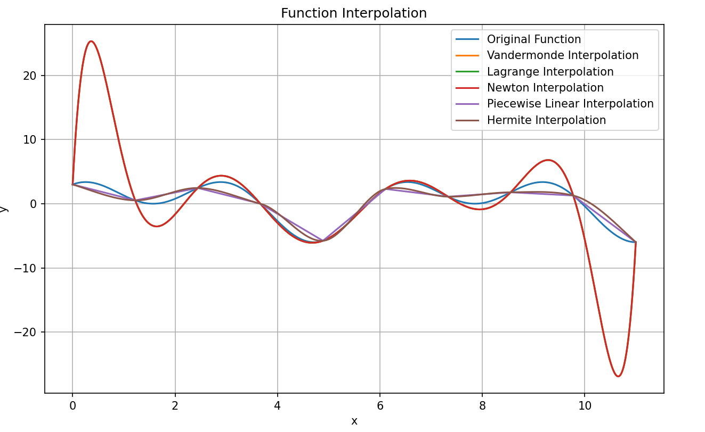
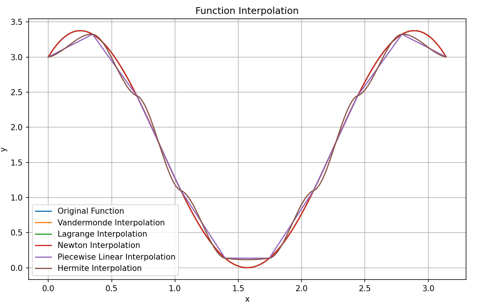

# 插值法
    本项目实现了范德蒙德多项式插值、拉格朗日插值、牛顿插值、分段插值、分段三次Hermite插值五种插值方式，调用代码能够绘制插值函数图像、并计算平均误差(声明：请使用专用查看工具查看readme,否则.md文件特有的格式会干扰阅读)

## 结果展示

## 项目安装  
1.安装python环境 Python 3.12.3  
2.创建虚拟环境 conda create -n interpolation -v python=3.12.3  
3.进入虚拟环境并安装依赖 pip install matplotlib  
4.运行main函数并获得结果  

## 代码结构
<pre>
main.py --调用--> |-----> Vandermond.py  
                  |-----> Lagrange.py  
                  |-----> Newtown.py
                  |-----> Linear.py
                  |-----> Hermite.py
</pre>

## 安装
